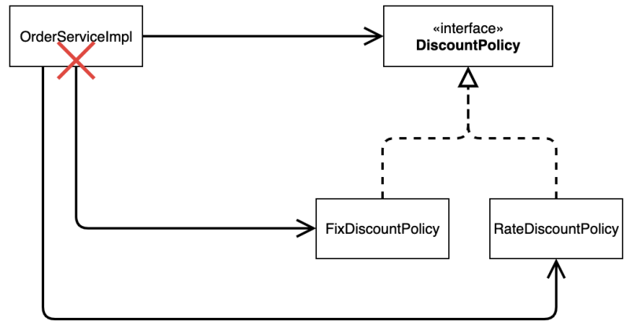

# 비즈니스 요구사항과 설계
### 회원
 - 회원을 가입하고 조회할 수 있다.
 - 회원은 일반과 VIP 두 가지 등급이 있다.
 - 회원 데이터는 자체 DB를 구축할 수 있고, 외부 시스템과 연동할 수 있다. (미확정)

### 주문과 할인 정책
 - 회원은 상품을 주문할 수 있다.
 - 회원 등급에 따라 할인 정책을 적용할 수 있다.
 - 할인 정책은 모든 VIP는 1000원을 할인해주는 고정 금액 할인을 적용해달라. (나중에 변경 될 수 있다.)
 - 할인 정책은 변경 가능성이 높다. 회사의 기본 할인 정책을 아직 정하지 못했고, 오픈 직전까지 고민을 미루
고 싶다. 최악의 경우 할인을 적용하지 않을 수 도 있다. (미확정)

요구사항을 보면 회원 데이터, 할인 정책 같은 부분은 지금 결정하기 어려운 부분이다. 그렇다고 이런 정책이 결정될 때
까지 개발을 무기한 기다릴 수 도 없다. 우리는 앞에서 배운 객체 지향 설계 방법이 있지 않은가!

인터페이스를 만들고 구현체를 언제든지 갈아끼울 수 있도록 설계하면 된다. 그럼 시작해보자.

## 회원 도메인 설계

### 회원 도메인 요구사항
 - 회원을 가입하고 조회할 수 있다.
 - 회원은 일반과 VIP 두 가지 등급이 있다.
 - 회원 데이터는 자체 DB를 구축할 수 있고, 외부 시스템과 연동할 수 있다. (미확정)

### 새로운 할인 정책 개발
새로운 할인 정책을 확장해보자.

주문 금액에 따른 할인 적용

- 악덕 기획자: 서비스 오픈 직전에 할인 정책을 지금처럼 고정 금액 할인이 아니라 좀 더 합리적인 주문 금액당 할
인하는 정률% 할인으로 변경하고 싶어요. 예를 들어서 기존 정책은 VIP가 10000원을 주문하든 20000원을 주
문하든 항상 1000원을 할인했는데, 이번에 새로 나온 정책은 10%로 지정해두면 고객이 10000원 주문시 1000
원을 할인해주고, 20000원 주문시에 2000원을 할인해주는 거에요!
- 순진 개발자: 제가 처음부터 고정 금액 할인은 아니라고 했잖아요.
- 악덕 기획자: 애자일 소프트웨어 개발 선언 몰라요? “계획을 따르기보다 변화에 대응하기를”
- 순진 개발자: … (하지만 난 유연한 설계가 가능하도록 객체지향 설계 원칙을 준수했지 후후)

- - -
> 참고: 애자일 소프트웨어 개발 선언 https://agilemanifesto.org/iso/ko/manifesto.html
- - -

순진 개발자가 정말 객체지향 설계 원칙을 잘 준수 했는지 확인해보자. 이번에는 주문한 금액의 %를 할인해주는 새로운
정률 할인 정책을 추가하자.

### 할인 정책 변경과 문제점 (DIP 위반, OCP 위반)

할인 정책을 변경하면서 OrderServiceImpl 코드 변경

'''java
public class OrderServiceImpl implements OrderService {
// private final DiscountPolicy discountPolicy = new FixDiscountPolicy();
private final DiscountPolicy discountPolicy = new RateDiscountPolicy();
}
''''

문제점 발견

- 우리는 역할과 구현을 충실하게 분리했다. OK 
- 다형성도 활용하고, 인터페이스와 구현 객체를 분리했다. OK
- OCP, DIP 같은 객체지향 설계 원칙을 충실히 준수했다
  * 그렇게 보이지만 사실은 아니다.
  
- DIP: 주문서비스 클라이언트( OrderServiceImpl )는 DiscountPolicy 인터페이스에 의존하면서 DIP를
 지킨 것 같은데?
  * 클래스 의존관계를 분석해 보자. 추상(인터페이스) 뿐만 아니라 구체(구현) 클래스에도 의존하고 있다.
    * 추상(인터페이스) 의존: DiscountPolicy
    * 구체(구현) 클래스: FixDiscountPolicy , RateDiscountPolicy
- OCP: 변경하지 않고 확장할 수 있다고 했는데!
  * 지금 코드는 기능을 확장해서 변경하면, 클라이언트 코드에 영향을 준다! 따라서 OCP를 위반한다.

#### 클래스 다이어그램으로 의존관계 분석
- 기대했던 의존관계
  
DiscountPolicy 인터페이스만 의존한다 생각했으나

- 실제 의존관계
  
**OrderServiceImpl**이 **DiscountPolicy** 인터페이스 뿐만 아니라 **FixDiscountPolicy** 인 구체 클래스도 함께 의존하고 있음 **<- DIP 위반**

* 정책 변경 (OCP 위반)
  
**FixDiscountPolicy**를 **RateDiscountPolicy**로 변경하는 순간 **OrderServiceImpl** 의 소스 코드도 함께 변경해야 한다 **<- OCP 위반**
  

#### [해결방안1]
* 문제
    * 클라이언트 코드(OrderServiceImpl)는 인터페이스(DiscountPolicy)뿐만 아니라 구체 클래스도 함께 의존
        * 구체 클래스를 변경할 때 클라이언트 코드도 함께 변갱 해야함
    * DIP 위반 > 추상에만 의존하도록 변경(인터페이스에만 의존)
      * DIP를 위반하지 않도록 인터페이스에만 의존하도록 의존 관계를 변경

'''java
public class OrderServiceImpl implements OrderService {
//private final DiscountPolicy discountPolicy = new RateDiscountPolicy();
private DiscountPolicy discountPolicy;
}
'''
* 인터페이스에만 의존하도록 설계와 코드를 변경
    * 구현체가 없어 코드를 실행할수없어 NPE 발생

#### [해결방안2]
별도로 인터페이스에 특정 구현 객체를 대신 생성하고 주입해야함 **(DI 진행)**

### 관심사의 분리

